# 🧠 Workana Data Engineer - Technical Test

Este repositorio contiene la estructura base para resolver la prueba técnica de Data Engineer para Workana, utilizando PostgreSQL como base de datos.

## 📁 Estructura del Proyecto

- `airflow_dags/`: DAGs de Airflow para orquestación local
- `etl/`: Scripts ETL en Python
- `sql/`: Consultas SQL y scripts de creación
- `modeling/`: Esquema dimensional y scripts relacionados
- `data/`: Datos de entrada y salida
- `ci/`: Archivos de configuración para CI/CD
- `tests/`: Pruebas unitarias e integración
- `logs/` y `output/`: Salidas del sistema y resultados

## ⚙️ Requisitos

- Python 3.12
- SQLite
- Airflow (opcionalmente en Docker)
- Librerías: ver `requirements.txt`

## ▶️ Uso rápido

```bash
python3 -m venv .venv
source venv/bin/activate
pip install -r requirements.txt
```

## 🧪 Pruebas

```bash
pytest tests/
```

## 🚀 Orquestación

Airflow o alternativa compatible. Inicia los DAGs desde `airflow_dags/`.

## 📌 Notas

Este proyecto usa SQLite como base de datos por defecto.

# ✅ Plan de Acción: Ejercicio 1 - Orquestación local

## 🎯 Objetivo

Crear un workflow end-to-end local que procese `sample_transactions.csv`, lo transforme con Python y lo cargue a una base de datos local (SQLite o PostgreSQL), usando una herramienta de orquestación como Airflow.

---

## ✅ Checklist de pasos

### 🛠️ Preparación del entorno

- [X] Crear entorno virtual (`venv`, `conda`, etc.)

```
PS C:\Users\enman\Downloads\COLFONDOS> & C:/Users/enman/Downloads/COLFONDOS/.venv/Scripts/Activate.ps1
(.venv) PS C:\Users\enman\Downloads\COLFONDOS> & C:\Users\enman\Downloads\COLFONDOS\.venv\Scripts\Activate.ps1
(.venv) PS C:\Users\enman\Downloads\COLFONDOS> cd C:\Users\enman\Downloads\COLFONDOS\workana_data_engineer_project
```

- [X] Instalar dependencias: `apache-airflow`, `pandas`, `sqlalchemy`, `psycopg2` (si usas PostgreSQL)

```
(.venv) PS C:\Users\enman\Downloads\COLFONDOS\workana_data_engineer_project> pip install -r requirements.txt
```

- [X] Crear estructura de carpetas del proyecto
  - `airflow_dags/`
  - `etl/`
  - `tests/`
  - `scripts/`
  - `data/`

### 🔁 Descarga y lectura de datos

- [X] Crear script para descargar `sample_transactions.csv`➜ `scripts/download_csv.py`
- [X] Implementar sensor de espera de archivo (con tamaño mínimo)
  ➜ `etl/sensors.py`

### 🧹 Transformación de datos

- [X] Crear función de transformación con `pandas` (lectura por chunks opcional)
  ➜ `etl/transform.py`

## 📌 Control de versiones y push a rama remota

Durante el desarrollo de esta prueba técnica, utilicé **Git** como sistema de control de versiones y **GitHub** como repositorio remoto. Para mantener el historial de cambios limpio y reflejar el avance del proyecto, ejecuté los siguientes comandos manualmente desde el entorno local:

```bash
git init
git add .
git commit -m "Initial commit - Workana Data Engineer challenge (SQLite)"
git branch -M main
git remote add origin https://github.com/ecuadrosg36/workana-data-engineer-test.git
git push -u origin main
```

### 🗄️ Carga a base de datos

- [X] Configurar conexión a SQLite

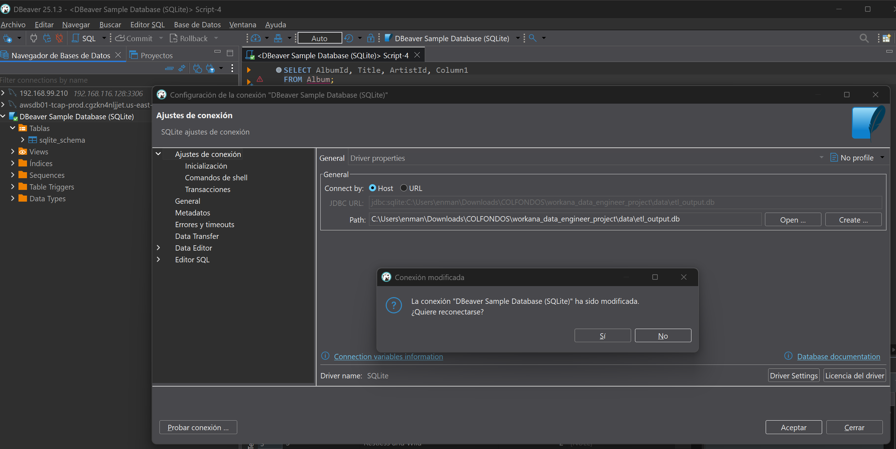

- [X] Crear función para carga a DB
  ➜ `etl/load.py`

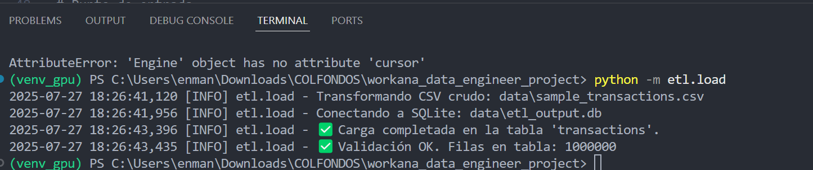

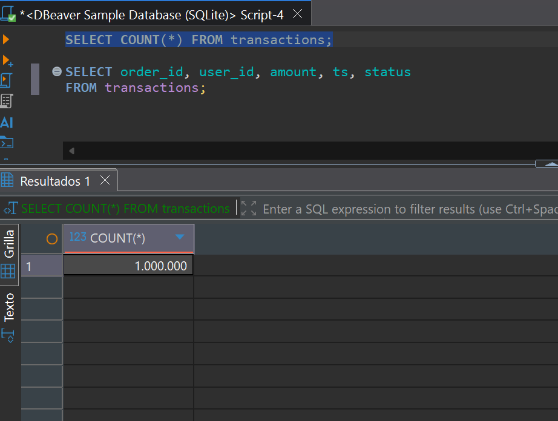

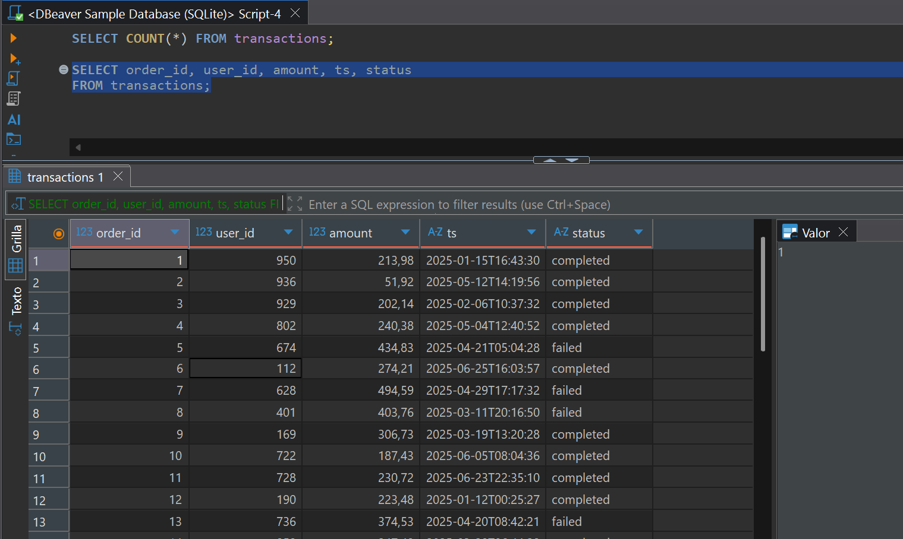

## 🧠 Por qué SQLite

Inicialmente se planeó usar PostgreSQL, pero se optó por SQLite como alternativa práctica. SQLite no requiere instalación, es compatible con SQLAlchemy y permite ejecutar el pipeline completo localmente.

El código está preparado para cambiar fácilmente a PostgreSQL si se desea.

### ⚙️ Orquestación con Airflow

- [X] Crear DAG con tareas:

  - Descargar archivo
  - Esperar archivo y tamaño
  - Transformar datos
  - Cargar a DB

## 🐳 Ejecución con Docker + Airflow (recomendado)

- [X] Esta configuración inicia Airflow (webserver + scheduler) y PostgreSQL como backend.

```
docker-compose up
```

  Esto realiza lo siguiente:

* Inicia PostgreSQL como base de datos de Airflow
* Inicializa Airflow
* Crea el usuario admin
* Expone la interfaz en: [http://localhost:8080](http://localhost:8080)

  **Credenciales de acceso:**
* Usuario: `admin`
* Contraseña: `admin`

---

## 🧠 Decisiones técnicas

* **SQLite** se utiliza como base de datos de carga por simplicidad y portabilidad.
* **Airflow en Docker** permite orquestación reproducible sin depender del sistema operativo.
* **Modularidad y pruebas** : el proyecto está dividido en componentes reutilizables (`scripts/`, `etl/`, `dags/`) con logging, validaciones y manejo de errores.

  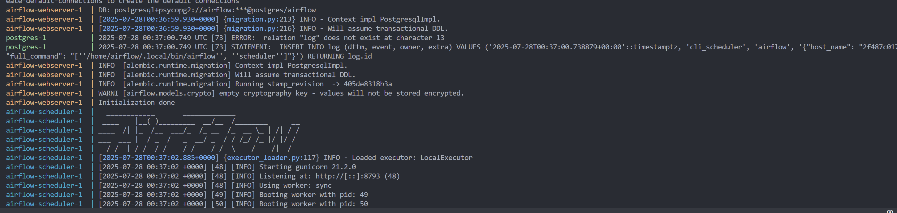

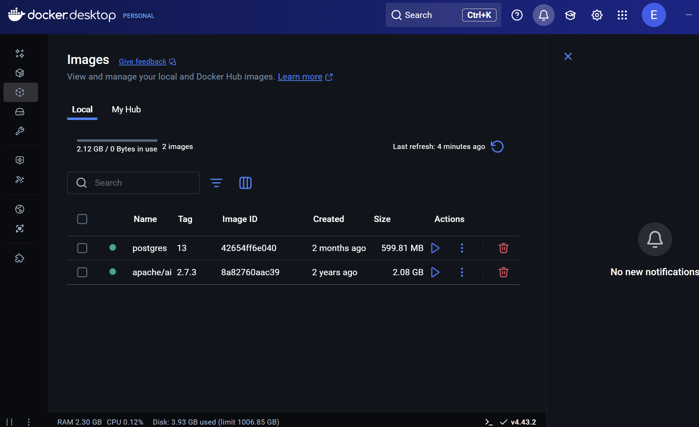

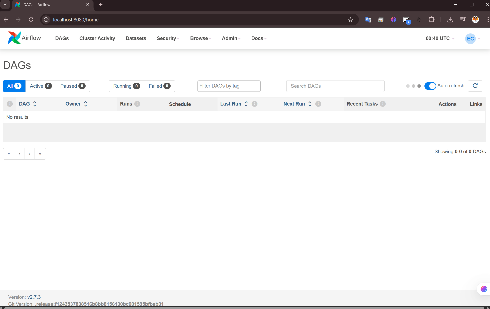

- [X] Agregar sensores y reintentos a las tareas
  ➜ `airflow_dags/etl_transactions_dag.py`

  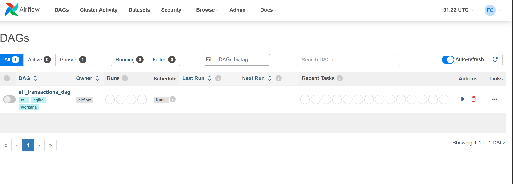

  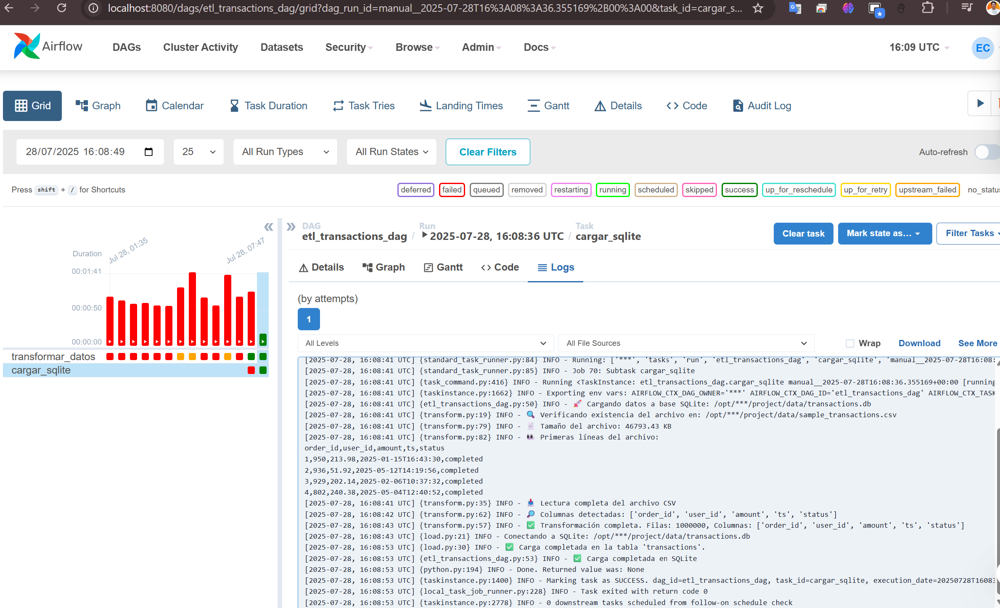

  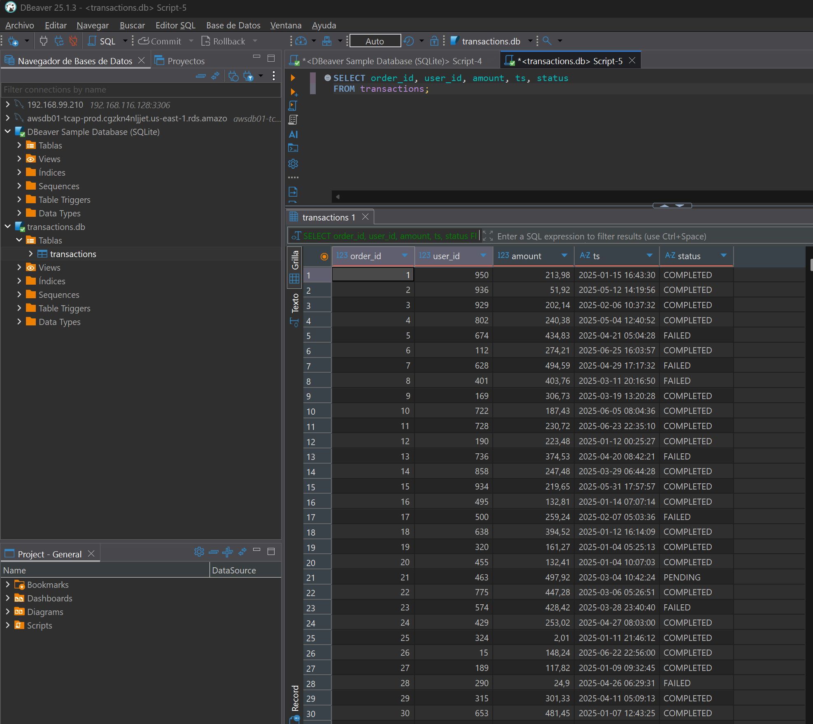

### 🧪 Testing

- [X] Escribir tests unitarios para transformación y carga➜ `tests/test_transform.py`➜ `tests/test_load.py`
- [X] Escribir test de integración para el DAG completo

  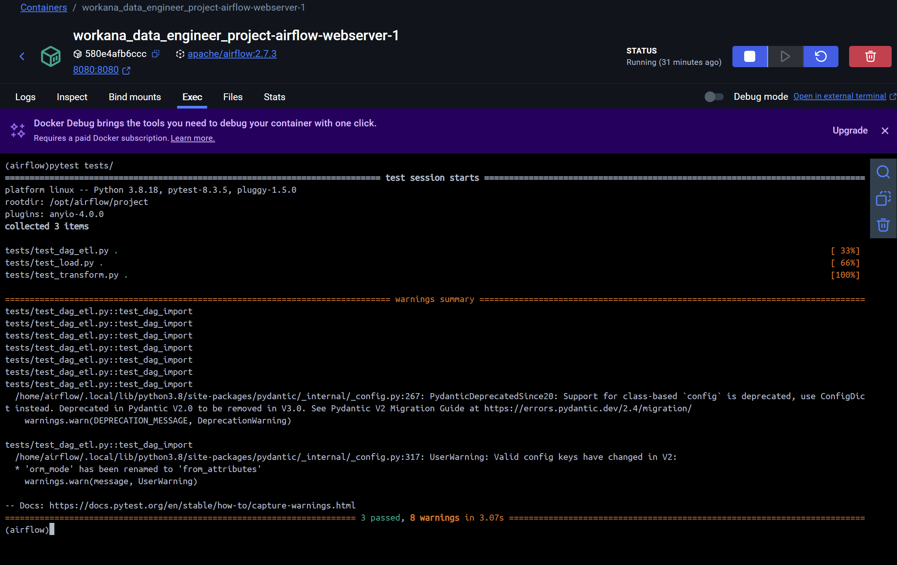

### 📈 Logging y métricas 

- [ ] Registrar logs detallados por tarea
- [ ] Medir tiempo de ejecución por paso
- [ ] Registrar cantidad de registros procesados

### 📬 Validaciones y alertas

- [ ] Validar si tabla destino está vacía
- [ ] Generar alerta/log en caso de error

## 🚀 Extras 

- [ ] Lectura eficiente con `pandas.read_csv(..., chunksize=...)`
- [ ] Soporte para `.csv.gz` con `compression='gzip'`
- [ ] Replicar el pipeline con Prefect o Dagster y comparar resultados

# ✅ Plan de Acción: Ejercicio 2 - SQL y análisis

## 🎯 Objetivo

Ejecutar consultas SQL sobre los datos ya cargados en la base de datos (desde el Ejercicio 1), para generar reportes, identificar errores, y proponer mejoras de rendimiento.

---

## ✅ Checklist de pasos

### 📄 1. Crear vista/tabla resumen por día y estado

- [ ] Definir estructura: fecha, estado, cantidad de transacciones
- [ ] Crear script SQL➜ `sql/view_summary_by_date_status.sql`
- [ ] Ejecutar script y verificar contenido

### 🔍 2. Query para usuarios con >3 transacciones fallidas en últimos 7 días

- [ ] Identificar campo `status` o equivalente para marcar transacción fallida
- [ ] Escribir query con `GROUP BY user_id`, `HAVING COUNT > 3`, `WHERE fecha >= current_date - 7`
- [ ] Guardar como
  ➜ `sql/query_frequent_failures.sql`

### 📈 3. Detección de anomalías (incrementos anómalos)

- [ ] Crear query que compare conteo diario con el promedio de días anteriores
- [ ] Definir umbral de alerta (ej: +100% sobre la media de los últimos 3 días)
- [ ] Guardar como➜ `sql/query_detect_anomalies.sql`
- [ ] (Opcional) Simular alerta/log si se detecta

### 🧱 4. Índices y triggers

- [ ] Crear índices sobre columnas claves (ej: `user_id`, `status`, `timestamp`)➜ `sql/create_indexes.sql`
- [ ] Diseñar triggers para:
  - [ ] Detectar valores fuera de rango (ej: fecha futura)
  - [ ] Detectar intentos de inserción duplicada
    ➜ `sql/create_triggers.sql`

### 📂 5. Particionamiento lógico

- [ ] Documentar propuesta de particionado (ej: por mes usando `timestamp`)
- [ ] Simularlo si DB lo permite (ej: `CREATE TABLE datos_2025_07` + `UNION ALL`)
- [ ] Explicar ventajas esperadas en rendimiento

---

## 🗂️ Enlaces por hacer / dependencias

- [ ] [ ] Asegurar que base de datos contiene los datos cargados del ejercicio 1
- [ ] [ ] Crear conexión desde SQL scripts o notebook a la DB
- [ ] [ ] Documentar cada query en el README con ejemplo de uso y output esperado

---

## 📝 Extras (si hay tiempo)

- [ ] Automatizar queries en script Python con SQLAlchemy o `psycopg2`
- [ ] Graficar resultados con `matplotlib` o `plotly` (opcional)
- [ ] Simular monitoreo con logs diarios

# ✅ Plan de Acción: Ejercicio 3 - ETL Python para archivo grande

## 🎯 Objetivo

Procesar un archivo `sample.log.gz` (~5 millones de líneas en formato JSONL) en modo streaming, filtrando errores y generando métricas agregadas por hora y endpoint.

---

## ✅ Checklist de pasos

### 📦 1. Preparar entorno y archivo

- [ ] Descomprimir o validar lectura directa del archivo `.gz`
- [ ] Validar estructura JSONL: una línea = un JSON
- [ ] Crear carpeta para scripts ETL
  ➜ `etl/large_log_etl.py`

### 🧾 2. Leer archivo por streaming

- [ ] Implementar lectura línea a línea desde `.gz`➜ Usar `gzip.open()` + `json.loads()`
- [ ] Filtrar solo líneas con `status_code >= 500`
- [ ] Manejar errores de parseo JSON con try/except

### 🧹 3. Limpiar y parsear campos

- [ ] Validar y limpiar campos clave (`timestamp`, `endpoint`, `status_code`)
- [ ] Convertir timestamp a datetime y redondear por hora

### 📊 4. Agregaciones por hora y endpoint

- [ ] Agrupar por `(hora, endpoint)` y calcular:
  - [ ] Total requests
  - [ ] Total con errores
  - [ ] Porcentaje de error
- [ ] Guardar en estructura tipo `pandas.DataFrame`

### 💾 5. Exportar resultados

- [ ] Exportar resultados a archivo Parquet comprimido (`Snappy`)➜ `output/errors_summary.parquet`
- [ ] Usar exportación por chunks si el DataFrame es muy grande

### ⚙️ 6. Performance y escalabilidad

- [ ] Implementar versión alternativa con `multiprocessing`
- [ ] Probar versiones con `polars` y/o `dask`
- [ ] Medir tiempos de ejecución y uso de memoria (profiling)

### 🐛 7. Logging y manejo de errores

- [ ] Configurar `logging` para registrar:
  - [ ] Errores de parseo
  - [ ] Métricas por batch
  - [ ] Tiempos de proceso
- [ ] Guardar logs en archivo (`logs/etl_run.log`)

---

## 🗂️ Enlaces por hacer / dependencias

- [ ] [ ] Validar ruta del archivo `sample.log.gz`
- [ ] [ ] Crear carpeta `output/` para Parquet
- [ ] [ ] Crear carpeta `logs/` para logs
- [ ] [ ] Agregar script al README con cómo correrlo

---

## 🧪 Extras (si hay tiempo)

- [ ] Escribir pruebas unitarias para funciones clave (parsing, filtrado, agregación)
- [ ] Graficar las métricas por hora con `matplotlib` o `seaborn`
- [ ] Integrar este ETL como parte del DAG general

# ✅ Plan de Acción: Ejercicio 4 - Modelado de Datos

## 🎯 Objetivo

Diseñar un modelo dimensional (estrella o copo de nieve) para representar las transacciones del archivo CSV, poblar las tablas desde los datos crudos, e implementar buenas prácticas de modelado analítico.

---

## ✅ Checklist de pasos

### 🧱 1. Diseño del modelo dimensional

- [ ] Identificar campos para la **tabla de hechos**: transacciones (ej: `monto`, `fecha`, `estado`, `user_id`)
- [ ] Identificar posibles **dimensiones**:
  - Dimensión tiempo (fecha/hora)
  - Dimensión usuario
  - Dimensión estado de transacción
- [ ] Elegir entre modelo **estrella (star)** o **copo de nieve (snowflake)** y justificar decisión
- [ ] Diagramar el modelo (opcional con [dbdiagram.io](https://dbdiagram.io) o similar)

### 🗄️ 2. Creación de las tablas

- [ ] Crear script SQL para tablas:
  - `fact_transacciones`
  - `dim_usuario`
  - `dim_fecha`
  - `dim_estado`
- [ ] Usar claves primarias en dimensiones y claves foráneas en la tabla de hechos
  ➜ `sql/model_tables.sql`

### 🚀 3. Carga inicial desde CSV

- [ ] Escribir script Python para poblar dimensiones y hechos desde `sample_transactions.csv`➜ `etl/load_model_data.py`
- [ ] Asegurar inserción sin duplicados en dimensiones
- [ ] Resolver dependencias entre tablas (poblar primero dimensiones)

### 🌀 4. Estrategia SCD (Slowly Changing Dimensions)

- [ ] Elegir e implementar SCD Tipo 1 o Tipo 2 en al menos una dimensión (ej: `dim_usuario`)
- [ ] Documentar cómo se maneja el historial y actualizaciones
- [ ] Incluir campos `is_current`, `valid_from`, `valid_to` si es SCD Tipo 2

### 📦 5. Particionamiento lógico y archivado

- [ ] Simular partición lógica de la tabla de hechos por mes (`YYYYMM`)
- [ ] Documentar ventajas para el rendimiento (lectura selectiva, limpieza, mantenimiento)
- [ ] Simular archivado (ej: mover datos viejos a otra tabla o archivo externo)

### ⚙️ 6. Performance y optimización

- [ ] Crear índices sobre claves foráneas y campos de filtro frecuentes (`fecha`, `estado`)
- [ ] Documentar decisiones de optimización (densidad de claves, índices, orden de carga)
- [ ] Validar que las relaciones estén bien formadas

---

## 🗂️ Enlaces por hacer / dependencias

- [ ] [ ] Confirmar estructura del archivo `sample_transactions.csv`
- [ ] [ ] Crear esquema de base de datos nuevo para el modelo (opcional)
- [ ] [ ] Agregar al README: esquema, scripts y ejemplo de queries sobre el modelo

---

## 🧪 Extras (si hay tiempo)

- [ ] Probar queries analíticas sobre la tabla de hechos (ej: KPIs por usuario/mes)
- [ ] Automatizar carga con Airflow
- [ ] Exportar modelo como `.erdiagram`, `.pdf` o imagen

# ✅ Plan de Acción: Ejercicio 5 - Git + CI/CD

## 🎯 Objetivo

Organizar todo el proyecto en un repositorio Git con estructura clara y reproducible, incluyendo automatización de pruebas, chequeos de calidad, y (opcionalmente) contenedores y orquestación local.

---

## ✅ Checklist de pasos

### 📁 1. Estructura modular del repositorio

- [ ] Crear las siguientes carpetas base:
  - `airflow/` → DAGs y configuración de Airflow
  - `etl/` → scripts ETL generales
  - `sql/` → scripts SQL y creación de modelo
  - `modeling/` → documentación del modelo dimensional
  - `data/` → archivos de entrada, comprimidos y resultados
  - `ci/` → archivos de configuración para CI
  - `tests/` → pruebas unitarias e integración
  - `logs/` y `output/` → salidas de ejecución
- [ ] Agregar archivos `README.md` y `.gitignore` por carpeta si es necesario

### 🌿 2. Estrategia de branches

- [ ] Definir ramas principales:
  - `main` → rama estable y productiva
  - `dev` → rama de integración y pruebas
  - `feature/<nombre>` → desarrollo de nuevas funciones (ej: `feature/etl-error-logs`)
- [ ] Configurar protecciones para `main` y `dev` (opcional en GitHub/GitLab)

### 🔄 3. Automatización con CI (GitHub Actions o GitLab CI)

- [ ] Crear workflow de CI/CD en `.github/workflows/ci.yml` o `.gitlab-ci.yml`
- [ ] Incluir en el pipeline:
  - [ ] Linter (`flake8`, `black`, `isort`)
  - [ ] Tests (`pytest`)
  - [ ] Chequeos estáticos (`mypy`, `bandit`)
  - [ ] Validación de DAGs (si se usa Airflow)
  - [ ] Reporte de cobertura (opcional con `coverage`)

### 🐳 4. Docker y ejecución reproducible (opcional)

- [ ] Crear `Dockerfile` para ejecutar ETL o DAGs localmente
- [ ] Crear `docker-compose.yml` si hay múltiples servicios (Airflow + DB)
- [ ] Documentar cómo correr el entorno en README
- [ ] Incluir rollback (ej: scripts para revertir carga) y reporting si es posible

---

## 🗂️ Enlaces por hacer / dependencias

- [ ] [ ] Conectar CI al repositorio en GitHub/GitLab
- [ ] [ ] Crear archivos de configuración: `.pre-commit-config.yaml`, `pyproject.toml`
- [ ] [ ] Agregar al README: instrucciones para contribuir, correr tests, y ejecutar CI

---

## 📜 Entregables mínimos

- [ ] README claro con estructura del proyecto y pasos para ejecución
- [ ] Logs y evidencia de ejecución en `logs/` o adjuntos
- [ ] Scripts y notebooks versionados
- [ ] Pipeline CI funcionando o documentado

---

## 🧪 Extras (si hay tiempo)

- [ ] Integración con Notebooks o documentación automatizada (ej: MkDocs)
- [ ] Reportes visuales o dashboards con métricas
- [ ] Pipeline para publicar imagen Docker o paquete Python
